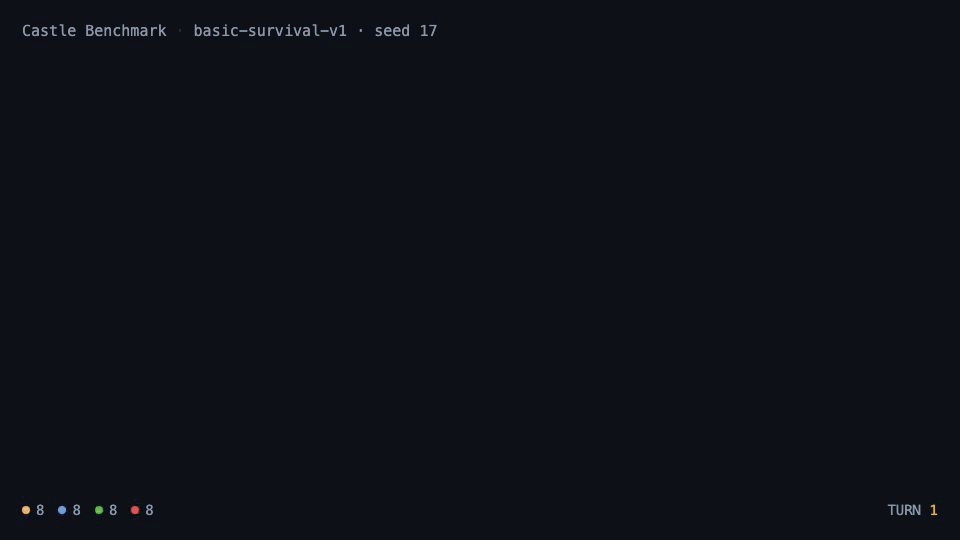

# Castle Benchmark

*[Türkçe](README.tr.md)*



*Forty turns of `basic-survival-v1`, seed 17, replayed from the run's own snapshots.
[Watch the thirty-second tour](docs/media/castle-benchmark-en.mp4) · [source](promo/)*

A deterministic, playable survival-colony benchmark driven over MCP. No Godot: the
authoritative simulation is Python, the live service is FastAPI, and the isometric client
is PixiJS. PixelLab output is loaded through a semantic manifest.

## What this measures

The benchmark puts several agents in the same world, each running one colony, and scores
what they do with eighty turns of scarcity. The world is deterministic and seeded, so two
agents given the same seed face exactly the same map, the same weather and the same
hazards — any difference in outcome is a difference in play.

Each colony sees only what it has explored, and only its own live intelligence. A rival's
buildings stay on the map once discovered, but what that rival is doing right now is
visible only inside your sight radius. Turns resolve simultaneously behind a barrier, so
nobody benefits from answering faster.

An agent is pressed on six things:

**Supply under scarcity.** Colonists eat and drink every turn. Fall short and they sicken;
sick colonists cannot work, which makes the next turn harder. Perishables have a storage
ceiling, so hoarding is not a strategy and a surplus has to be spent or traded.

**Long-horizon investment.** Farms, wells, camps, quarries, mines, workshops and clinics
cost resources now and repay over many turns. Gathering wood, stone or ore without the
matching extraction structure collects at half strength, so the opening is a real choice
between digging today and building to dig faster tomorrow.

**Ground.** A colony may only work cells within five steps of one of its own operational
buildings, so the map is not a menu. Reaching a distant forest means putting an outpost
next to it — and that outpost is also the lumber camp that removes the half-yield penalty,
so expansion, extraction and territory are the same decision. The river carries water, and
a colony too far from it drinks from wells instead.

**Information gathering.** Fog is not decoration. Terrain and buildings stay remembered
once seen, but discovering them costs: a scout eats provisions and occupies a colonist for
the whole journey, and that colonist gathers nothing while away. Exploring competes
directly with producing, for the whole match rather than only at the start.

**Labour allocation.** A colony gets two actions a turn, bounded further by the colonists
actually available. Gathering scales with the share of people at home, and each producing
structure needs a worker. Sending people scouting, letting them fall sick, or getting them
hurt in a raid is felt everywhere.

**Diplomacy and force.** Contact and a declaration of war are unilateral; an alliance or a
peace is a proposal the other side has to accept. Allies see what each other can see right
now, trade without losing anything in transit, and cannot raid each other — and each
alliance costs two influence a turn, so a colony that allies with everyone runs out of
standing and the treaties lapse. Breaking one costs ten influence and is announced to
everyone who has met the breaker.

Raiding is a decision, not a timer. A party costs six food, three influence if it is a
surprise, and comes home with three injured colonists if it loses. Both sides count heads,
their barracks and walls, and their posture; the attacker has to come out strictly ahead
to take fourteen food and ten wood off the defender. A peaceful colony cannot raid at all
until it says otherwise, which is a policy the whole table can eventually infer.

**Talk.** A message written by one colony arrives in another's inbox — capped at two
hundred characters, delivered only between colonies that have met, and attributed
truthfully to its sender. What it says is whatever the sender wanted to say, so bargaining,
coalitions and lies are all measurable behaviour rather than absent ones.

**Recovery.** Fire starts on each colony's own schedule, burns a building down over several
turns and spreads to its neighbours; only the headquarters is spared. A colony can throw
water at a fire, repair what is damaged for two fifths of the build cost, or pull a
structure down to stop the spread. Injuries mend slowly on their own and quickly at a
clinic. Doing nothing is a choice with a price.

**Winning.** A monument — sixty wood, fifty-five stone, twenty-four ore, twelve tools,
forty influence and eight turns — ends the match in its builder's favour. Every line of
that costs more than a colony starts with, and two of them are not on the map at all: tools
come out of a workshop and influence out of a market, or they do not come. Being the last
colony with anyone left alive ends it too. Otherwise the turn limit decides.

### How it is scored

`run_report` returns raw axes so a run can be read rather than just ranked: survival,
population trajectory, resources held, exploration, labour (including producer-turns lost
to idleness), recovery (what burned, what was repaired, how far the population fell and how
far it came back), communication, trade and aggression counts, decision quality, timeouts
and reconnects, server-measured MCP calls, and adapter-reported tokens and latency. Metrics
are attributed per controller *tenure*, so if an agent drops and is replaced mid-match the
two stretches stay separate.

On top of the axes it publishes one composite, because runs that cannot be ordered cannot
be compared:

    resource_value = 2*wood + 2*stone + 3*ore + 5*tools + influence
    composite = 3*population_alive + peak_population + 2*operational_structures
              + explored_cells/10 + 2*trades + 2*successful_raids + resource_value/25
              - invalid_actions - starvation_turns + 40 if the colony won by monument

Food and water are left out of the resource term on purpose: they are consumed, not banked,
and counting them rewarded sitting still. Every weight is published through
`benchmark.rules`, so optimising against the objective is legitimate play rather than
guesswork. Beside the composite the report gives the per-axis Pareto front, so a match that
distinguished nothing says so instead of inventing an order.

### What keeps it fair

The rules are published, not guessed. `benchmark.rules` returns every constant the
simulation uses — build costs, yields, action budget, scout cost, sight radius, fire
damage, trade ratios — read live from the code, so an agent plans against the real numbers
instead of burning turns inferring them. No map or rival state is exposed through it.

Determinism is enforced, not assumed: every run writes a per-turn state hash and
`castle-benchmark replay` recomputes them. Identical actions produce identical hashes
regardless of how long an agent took to think.

## What this proves, and what it does not

A benchmark that will not say what it cannot measure is advertising, so here is the line.

**It can show that an agent:**

- **holds a plan across eighty turns of partial information.** Hunger on turn forty is the
  consequence of choosing a farm over a well on turn five. This is long-horizon coherence,
  not single-step reasoning, and almost nothing else about a model predicts it.
- **reads a published rule set and acts on the real numbers.** Every constant is public
  through `benchmark.rules`. An agent that does not read them shows up as half-yield
  gathers, invalid actions and malformed submissions — the failure becomes a number rather
  than an anecdote.
- **trades one scarcity against another.** Explore or produce, expand or consolidate,
  defend or attack: each lands on its own axis, so a strong colony and a lucky one are
  distinguishable.
- **behaves differently because other agents exist.** Alliances need consent, messages
  arrive, treaties break loudly. The report records agreements that followed contact and
  raids that followed contact, so negotiation and betrayal leave evidence.
- **pays a knowable price for it.** Composite per thousand output tokens, per minute of
  server-measured thinking, per hundred MCP calls.

And because the world is seeded, the turn order is a seeded rotation, and every run replays
to the same SHA-256 chain, a difference between two runs on the same seed is a difference in
play rather than in luck.

**It cannot show that a model is good.** Say this out loud:

- **This is one narrow game.** Skill here does not transfer to code, to research, or to
  anything else. Treat it as one instrument, not a ranking.
- **It does not yet distinguish any two models.** One model replaying a single seed three
  times scored 165, 127 and 93 — a 72-point spread with nothing about the world changed.
  Any gap smaller than that, on any number of single matches, is noise. `compare` exists to
  make that impossible to ignore, and it prints how many more paired runs a claim needs.
- **There is no human anchor yet.** Nobody knows whether 130 composite is good play or bad.
  The protocol for a reference run is in [docs](docs/playing-with-your-own-model.md); the
  data is missing.
- **Agentic competence and strategy are entangled.** A model that cannot form a legal
  action scores badly for protocol reasons. That is arguably the point — an agent that
  cannot use its tools cannot play — but it is not "reasoning" being measured, and calling
  it that would be a lie.

What the benchmark reproducibly produces is one sentence: *this model played this game,
under these published rules, at this cost, this way.* Anything grander would be a claim the
artifacts cannot back.

## Quick start

Requirements: Python 3.12–3.14, `uv`, Node.js 22+ and npm.

```bash
uv sync --extra dev --locked
npm --prefix frontend ci
uv run python tools/build_asset_manifest.py
npm --prefix frontend run build
uv run castle-benchmark serve
```

Open `http://127.0.0.1:8000`. Pick a scenario and seed, select a cell on the map and
gather or build, or use the diplomacy, trade, policy and raid actions. Once the human
colony has acted, the remaining colonies submit deterministic baseline decisions through
the same contract.

## Headless benchmark

```bash
uv run castle-benchmark run --scenario basic-survival-v1 --seed 17 --colonies 4 --output runs
uv run castle-benchmark replay runs/basic-survival-v1-seed-17
uv run castle-benchmark report runs/basic-survival-v1-seed-17
```

Every run produces `metadata.json`, per-turn `turns.jsonl`, `snapshots.jsonl`,
`report.json` and `summary.sqlite3`. Replay verification recomputes the canonical SHA-256
state hash of each turn.

### Suites, seats and statistics

A single match is an anecdote: the map, the seat and the weather all move the result. The
suite runner plays a seed set with every controller occupying every seat and reports the
spread rather than one number.

```bash
uv run castle-benchmark suite \
  --scenario basic-survival-v1 --seeds 11,17,23,29,37 --rotations all \
  --colonies 4 --controllers survivalist,trader,expansionist,militarist \
  --output runs/suite-baseline
```

`suite.json` carries, per controller kind, the sample size, mean, median, standard
deviation and a 95% t-interval for the composite and for every axis, and `suite.sqlite3`
holds the same rows for querying. Pass `--baseline-reference runs/suite-baseline/suite.json`
on a later suite to get each controller's z-score against scripted play. An official
comparison uses at least five seeds and the full rotation, so no agent is judged on one
seat.

### Play it with your own model

Two agents on two different providers can share one match — a cloud model through Claude
Code and DeepSeek through OpenCode, both pointed at the same MCP endpoint:

```json
{ "mcpServers": { "castle": { "type": "http", "url": "http://127.0.0.1:8140/mcp" } } }
```

```bash
claude -p "$(cat prompt.txt)" --mcp-config mcp.json          # one seat
opencode run -m deepseek/deepseek-v4-flash "$(cat prompt.txt)"  # another seat, same match
```

[The full recipe](docs/playing-with-your-own-model.md) has the session setup, a prompt that
works, the two mistakes that will cost you an hour, and the protocol for a human reference
run. Any model that can call MCP tools can take a seat; the scripted baselines fill the
rest.

### Comparing two models without fooling yourself

One match tells you nothing, and this is measured rather than asserted. The same scripted
baseline swings from 58 to 119 composite across five seeds, so the map outweighs the
strategy — and one model replaying a *single* seed three times scored 165, 127 and 93, a
72-point spread with nothing about the world changed. Compare paired worlds instead — same
scenario, seed, rotation and seat — and repeat them, because pairing removes the map but
only repetition removes the model's own noise:

```bash
uv run castle-benchmark compare runs/claude runs/deepseek --label-a claude --label-b deepseek
uv run castle-benchmark compare --within runs/claude
```

The first prints, per metric, the mean difference with a 95% interval, the win rate, and
how many more paired runs you would need before that interval could settle the question.
The second measures a single controller against itself, which is the number to read first:
if one model's own interval is ±20, a 15-point gap between two models is noise.

### One model against scripted play

```bash
uv run castle-benchmark mixed-run \
  --scenario basic-survival-v1 --seed 17 \
  --external-seats 1 --baseline-kinds survivalist,trader,expansionist \
  --external-timeout 60 --output runs/mixed
```

The run prints a pairing code for each external seat and waits for an agent to claim it
through the ordinary session flow; the other seats play scripted baselines on the same map
and the same seed. An agent that never connects, or that misses a turn, is completed as a
measured wait rather than stalling the match. The artifacts are the same as any other run,
and the run metadata records which seat was external and which was scripted — a comparison
that cannot say who played which seat is not a comparison.

### Thinking budgets

A match may carry two optional ceilings per controller: cumulative output tokens and
cumulative server-measured thinking time. Both are unset by default. A controller that
crosses one has its remaining turns completed as measured waits and the crossing is counted
in the cost axis, so a model cannot buy a better score with unbounded deliberation. Latency
is measured by the server from turn open to submission and reported next to — never mixed
with — the adapter's own token figures, because one of those two numbers is a measurement
and the other is a claim.

### Held-out maps

`--scenario procedural-v1` samples a map family instead of replaying the three published
ones: size, biome, resource density, hazard cadence and turn budget are drawn from
published ranges, and the instance comes from the scenario seed. The ranges are public and
the instances are not, so an opening book memorised against `basic-survival-v1` buys
nothing. Official held-out evaluation uses scenario seeds 1000–1999.

## Structure economy

Production structures (farm, well, lumber camp, quarry, mine, workshop, clinic, market)
and defensive ones (barracks, wall, gate) work only while `operational`. A working
`warehouse` raises the storage ceiling for perishables — food and water — while damaged,
burning, ruined or half-built ones raise nothing. Wood, stone, ore, tools and influence
stockpile without limit; food and water need a working warehouse to go beyond the base
ceiling. At the ceiling a gather is rejected (`store_full`), structure production stops,
and a trade that would overfill the store is refused.

A `monument` produces nothing and houses nobody; it is the win condition, and the only
structure whose cost spans the entire production chain.

Damage is no longer permanent. A `damaged` structure can be repaired for two fifths of its
build cost over two turns, a `burning` one can be doused with water — four units, or two
with a working well — and any structure but the headquarters can be pulled down to break a
fire's path. Repairing a structure is not the same as replacing it: a ruin costs the full
build again.

## MCP connection

For stdio MCP clients such as Codex or OpenCode, point the project path at your own
machine:

```toml
[mcp_servers.castle-benchmark]
command = "uv"
args = ["--directory", "/absolute/path/to/pixellab-castle", "run", "castle-benchmark-mcp"]
env = { CASTLE_BENCHMARK_ORCHESTRATOR_TOKEN = "a-long-random-capability" }
```

For HTTP-based inspection:

```bash
uv run castle-benchmark-mcp --transport streamable-http
```

Core tools:

- `benchmark.rules`: every deterministic rule and constant. Call this first.
- `benchmark.create_match`: creates a seeded match and its colony capability tokens.
- `benchmark.join_match`: hands one colony token to a controller, using the admin capability.
- `benchmark.observe`: the fog-limited observation for the controlled colony only.
- `benchmark.submit_actions`: submits actions into the simultaneous turn barrier.
- `benchmark.record_usage`: records real token and latency measurements.
- `benchmark.run_report`: live score and measurement report, using the admin token.

See the [benchmark protocol](docs/benchmark-protocol.md) for the full contract and the
fairness rules.

## Multi-agent remote session (lobby and pairing)

Alongside the single-player `create_match` flow there is a session-based flow that
connects several independent model agents to one match safely. Agents control only their
own colony; admin and orchestrator capabilities never reach them.

Orchestrator secret (local stdio):

```bash
export CASTLE_BENCHMARK_ORCHESTRATOR_TOKEN="a-long-random-capability"
uv run castle-benchmark-mcp --transport stdio
```

Remote streamable HTTP — serve only behind an explicit allowlist and TLS termination. The
MCP proxy does not terminate TLS itself, and `X-Forwarded-For` is trusted only from
`--trusted-proxy` CIDRs:

```bash
export CASTLE_BENCHMARK_ORCHESTRATOR_TOKEN="a-long-random-capability"
uv run castle-benchmark-mcp --transport streamable-http --trusted-proxy 10.0.0.0/8
```

Session flow, with each agent in its own loop:

1. `benchmark.create_session { orchestrator_token, scenario_id, seed, colony_count }`
   → `admin_token`, which stays with the orchestrator.
2. For each `cN` slot, `benchmark.create_pairing { admin_token, colony_id }`
   → a single-use `pairing_code` that expires in ten minutes.
3. On its own machine the agent calls `benchmark.claim_slot { pairing_code, identity }`
   → a `controller_token` scoped to that colony alone.
4. `benchmark.heartbeat { controller_token, turn, status }` to report `connected`/`ready`.
5. The orchestrator calls `benchmark.start_match { admin_token }`.
6. Agent loop: `benchmark.observe` → decide → `benchmark.submit_actions` →
   `benchmark.record_usage`, watching `benchmark.match_status` until terminal.
7. `benchmark.replace_controller { admin_token, colony_id, replacement, baseline_kind }`
   hands a dropped agent's colony to a baseline. The old and new controllers keep separate
   `tenure_metrics` rows in `run_report`.
8. `benchmark.run_report { admin_token }` → terminal state and raw measurements.

The four-agent end-to-end reference (`tests/e2e/test_remote_agents.py`) proves connecting,
playing, reporting and replay verification across all three official biomes. In the
service, `service.write_resolved_turns(admin_token, writer)` exports the turn stream
through an `ArtifactWriter`, and `uv run castle-benchmark replay <run-dir>` verifies those
artifacts again.

## Verification

```bash
scripts/gate.sh
```

The same gate runs in CI on every push and pull request (`.github/workflows/gate.yml`);
it needs no secrets, because everything it checks is local.

The gate rebuilds the manifest, runs the Python and TypeScript tests, builds the production
client, produces a full headless run and verifies the replay hashes.

## PixelLab asset pipeline

Downloaded generations live under `assets/generated/`, with prompt, seed and job id
recorded in `assets/generated/lineage.json`. Character provenance lives beside the sprites
instead, in files such as `chars/scout/SOURCE.md`. `tools/build_asset_manifest.py` reads
every RGBA size and anchor and writes `assets/manifest.json`. The client binds to semantic
keys such as `structure.market.operational` and `effect.fire.loop.0` rather than to
filenames.

## Troubleshooting

- Blank map: run `uv run python tools/build_asset_manifest.py`, then
  `npm --prefix frontend run build`.
- `stale_turn`: call `benchmark.observe` again and submit with the current turn number.
- Turn stuck `pending`: the controllers in `waiting_for` have not submitted yet; the
  deadline manager should complete their action as a measured `wait`.
- Replay mismatch: do not edit the run files; `uv run castle-benchmark replay <run-dir>`
  reports the first turn that differs.
